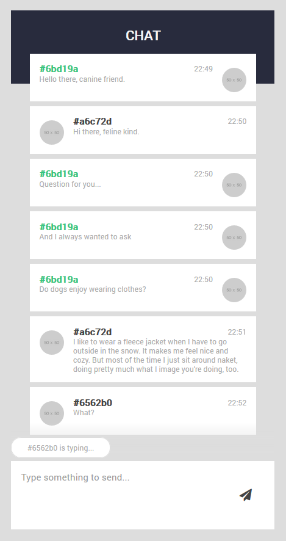

# Chat-Demo

This is a very simple chat-demo application built on top of
[expressjs](https://expressjs.com/) and [socket.io](https://socket.io/). 

<p align="center">
  
</p>

## Installation

Be sure to have [node and npm](https://www.npmjs.com/) installed globally.

```bash
# clone the repository
git clone https://github.com/mysliwietzflorian/chat-demo.git
cd demo-chat

# install npm dependencies
npm install

# run the server
node server/index.js

# Browse to client site (can be on multiple different browsers)
http://localhost:8080/
```

If you have trouble with starting the server you might be using port 8080 for 
something different. Either close that application blocking the port or define a
different one in the top of `server/index.js`.

## Questions and Issues

If you have any questions feel free to contact me on GitHub.

For problems and issues please use
[GitHub Issues](https://github.com/mysliwietzflorian/chat-demo/issues). 

## License

[MIT](LICENSE). Feel free to use it for whatever you want.
